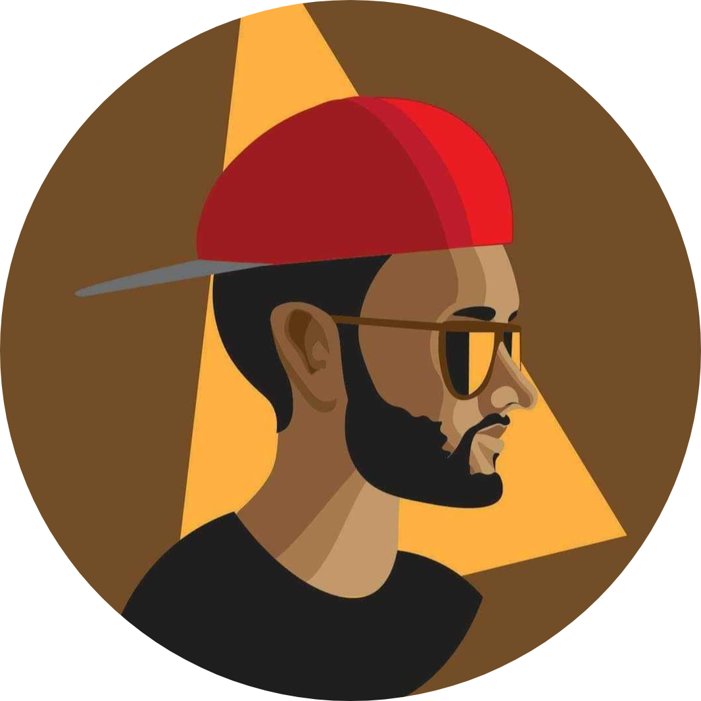

<h3 align="center">Hey there, I'm <a href="https://ishmam.one">Ishmam</a>  </h3>

  
   
  
  
   

## 📊 Github Stats (Expand to View) 

 
  
<b>💻 GitHub Profile Stats</b>

   
  

	
  

    
 
  &nbsp;
	  
   
  <b>Note:</b> Top languages is only a metric of the languages my public code consists of and doesn't reflect experience or skill level.
  

  
<b>⚡ Recent GitHub Activity</b>

   
   
   

 

